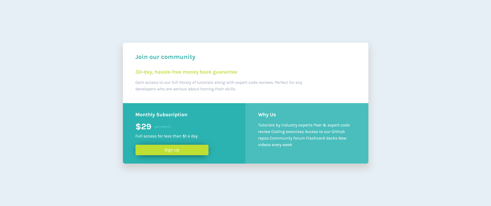

# Frontend Mentor - Single price grid component solution

This is a solution to the [Single price grid component challenge on Frontend Mentor](https://www.frontendmentor.io/challenges/single-price-grid-component-5ce41129d0ff452fec5abbbc). Frontend Mentor challenges help you improve your coding skills by building realistic projects.

## Table of contents

- [Overview](#overview)
  - [The challenge](#the-challenge)
  - [Screenshot](#screenshot)
  - [Links](#links)
  - [Built with](#built-with)
- [Author](#author)

## Overview

### The challenge

Users should be able to:

- View the optimal layout for the component depending on their device's screen size
- See a hover state on desktop for the Sign Up call-to-action

### Screenshot

### Links

- Solution URL: [solution URL here](https://github.com/sahir2008/single-price-grid-component)
- Live Site URL: [live site URL here](https://frontend-single-price-grid.netlify.app/)

### Built with

- Semantic HTML5 markup
- CSS custom properties
- CSS Grid

## Author

- Website - [Sahir Mohsen](https://sahir-html-css-portfolio.netlify.app/)
- Frontend Mentor - [@sahir2008](https://www.frontendmentor.io/profile/sahir2008)
- Twitter - [@SahirMohsen](https://www.linkedin.com/in/sahir-mohsen-602706128/)

## Got feedback for me?

I love receiving feedback! We're always looking to improve our code and our career. So if you have anything you'd like to mention, please share with me your feedback.
